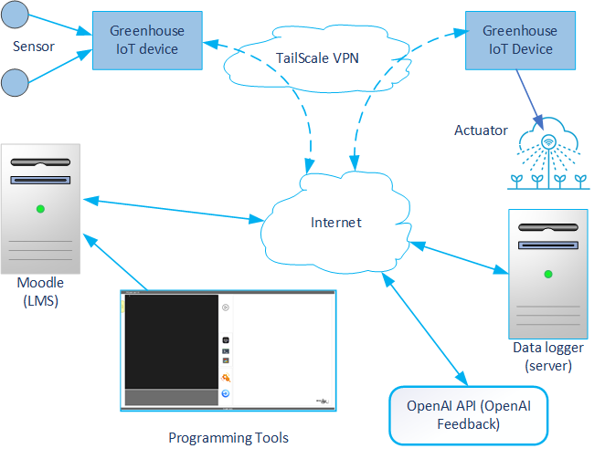

# PiCode 
AI-supported live coding and IoT learning module integrated with Moodle LMS.

This project is part of a research initiative focused on developing an AI-supported live coding and IoT learning module integrated with Moodle LMS. The aim of the research is to enhance students’ computational thinking and problem-solving skills through intelligent learning environments. By integrating artificial intelligence, live coding, and IoT simulations into Moodle, this project investigates how real-time AI feedback and embedded IoT interaction can improve programming comprehension and practical engineering learning outcomes. The system also supports performance analytics to help educators evaluate student progress based on authentic coding and device-control activities.

**Archiceture**

The system integrates an LMS (Moodle), IoT devices, and an AI feedback module through a secure VPN connection.
The diagram below illustrates the architecture of the AI-supported live coding and IoT learning environment.

**Description**

The AI-supported live coding and IoT learning module integrated with Moodle LMS is an interactive learning environment that combines artificial intelligence, real-time programming, and Internet of Things (IoT) simulations. Within Moodle, the module enables students to write, execute, and test code directly in the browser through an embedded LMS-based editor. AI assistance provides instant code feedback, suggestions, and explanations to help learners understand programming logic and IoT system behavior. The module connects to simulated or real IoT devices, allowing learners to observe sensor data, control actuators, and analyze system responses in real time. All student interactions are logged for performance tracking and later evaluation by instructors.

**TailScale VPN**

Provides a secure, encrypted network that connects all IoT devices with the LMS and servers through the internet. This ensures real-time communication and remote access while maintaining data privacy.

**Internet Layer**

Acts as the communication backbone, linking the LMS, IoT network, and AI feedback module. It enables data flow between students’ activities in the LMS and physical IoT responses in the greenhouse.

**Moodle (LMS)**

Hosts the PiCode Lab live coding environment, where students can write and execute code directly from the browser. The LMS manages user sessions, logs, and integration with SCORM packages.

**Programming Tools**

Embedded within the LMS, the **LMS-based editor** allows students to develop control scripts, run code, and observe feedback in real time. The module logs each interaction for later analysis. You can download the SCORM module from the CourseLab directory before importing it into your LMS. For detailed setup instructions, please read README.pdf.

**Data Logger Server (Optional)**

Receives and stores sensor readings from IoT devices. It also forwards relevant data to the LMS and supports synchronization for monitoring and evaluation.

**OpenAI API (Feedback Module)**

Processes student-submitted code and provides automated feedback through GPT-based analysis. It acts as a virtual instructor that evaluates logic, syntax, and coding efficiency.

System Flow :

  - The student writes and runs code in the LMS-based editor.
  - The LMS sends the command to IoT devices via the VPN network.
  - Sensors collect data and actuators respond accordingly.
  - The data logger records all activity and sends updates to the LMS.
  - The OpenAI API provides AI-generated feedback to guide student learning.

